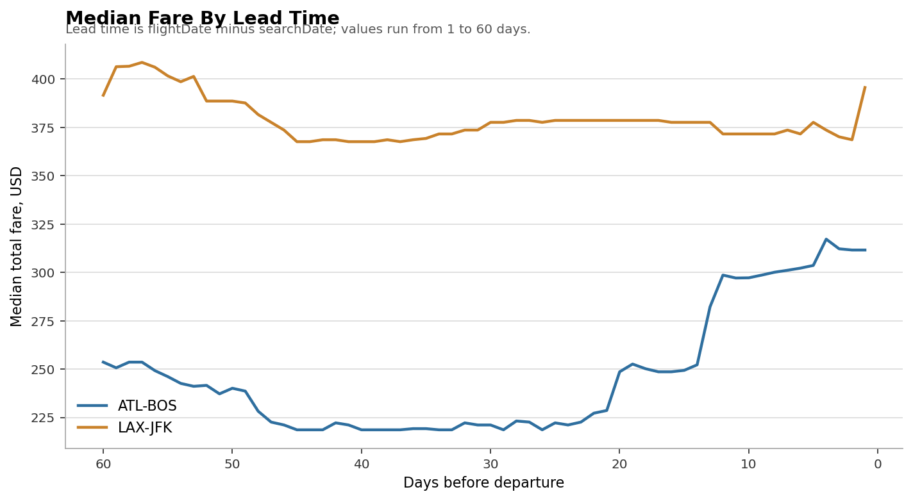
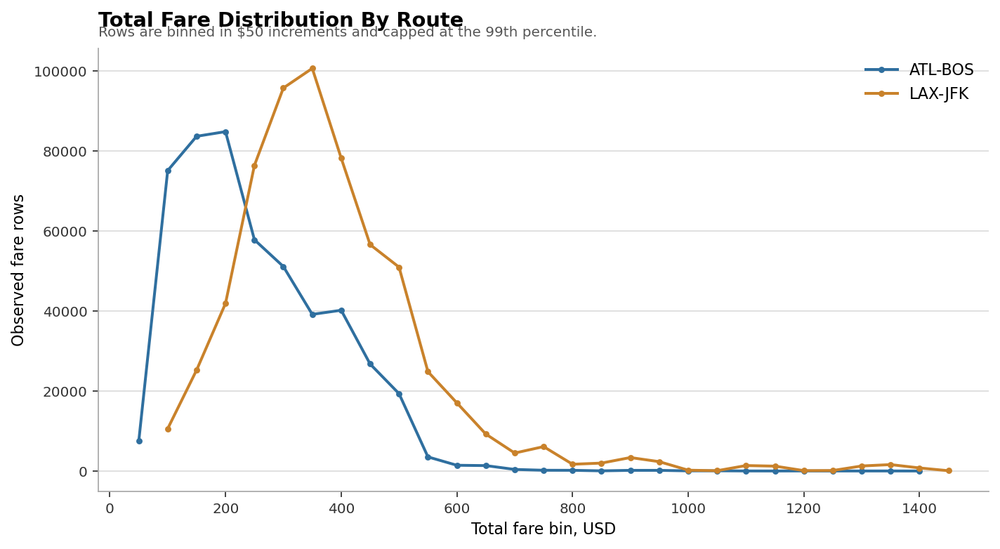

# Airfare Intelligence System

Airfare Intelligence is a data science portfolio project that analyzes Expedia flight fare observations, estimates itinerary prices, adds price context, and tests whether a historical BOOK/WAIT decision can be evaluated from repeated fare observations.

The main goal is not just to train a model. The project is designed to show the full data science workflow: data validation, SQL analysis, cleaning, EDA, statistics, leakage-aware modeling, baseline comparison, uncertainty, and API deployment.

## Business Problem

Airline fares vary by route, airline, cabin, stops, duration, time of day, seat availability, and booking lead time. A useful airfare system should answer questions such as:

- What factors are associated with fare differences?
- Can we estimate the expected fare for an itinerary?
- Is an estimated fare low, typical, or high compared with similar observed fares?
- When repeated observations exist, can we evaluate whether waiting historically led to a cheaper fare?

The project deliberately avoids unsupported claims. Static airfare data can support price estimation and descriptive lead-time analysis, but a true BOOK/WAIT label requires repeated observations of the same or comparable itinerary over time.

## Dataset

Source data: Expedia flight-price observations from a public airfare dataset.

Raw file:

```text
data/raw/itineraries.csv
```

The raw CSV is about 31 GB, so the project uses DuckDB to create a smaller route-level working subset.

Validated raw-data facts:

| Metric | Value |
|---|---:|
| Raw rows | 82,138,753 |
| Search-date range | 2022-04-16 to 2022-10-05 |
| Flight-date range | 2022-04-17 to 2022-11-19 |
| Origin airports | 16 |
| Destination airports | 16 |
| Routes | 235 |

Working subset:

| Route | Rows | Leg IDs | Avg Fare | Median Fare |
|---|---:|---:|---:|---:|
| ATL-BOS | 493,277 | 37,196 | 275.42 | 248.60 |
| LAX-JFK | 625,496 | 40,860 | 427.97 | 377.60 |

Total working subset:

```text
1,118,773 rows
78,056 legIds
```

## Data Validity

The most important validation check was whether the same `legId` appears across multiple `searchDate` values.

| Route | Leg IDs | Repeated Across Search Dates | Multiple Fare Values |
|---|---:|---:|---:|
| ATL-BOS | 37,196 | 29,972 | 26,246 |
| LAX-JFK | 40,860 | 34,000 | 31,084 |

This supports temporal fare analysis because many itineraries are observed repeatedly and many have changing fares.

However, the project still avoids claiming guaranteed future prices. The BOOK/WAIT component is framed as an evaluated historical decision problem, not a live guarantee.

## Project Architecture

```text
api/        FastAPI prediction service
data/       raw, interim, and processed data files
docs/       methodology notes
models/     saved joblib artifacts
notebooks/  optional explanatory notebooks
reports/    generated figures and result tables
scripts/    reproducible phase scripts
sql/        SQL analysis
src/        reusable Python modules
tests/      future tests
```

See [docs/project_structure.md](docs/project_structure.md) for the reproducible script flow.

## Data Layer

The raw CSV is too large for normal Pandas-first exploration. The project uses DuckDB to:

- scan the 31 GB CSV safely
- create a two-route Parquet subset
- store processed tables in `data/processed/airfare.duckdb`
- run SQL analysis over cleaned and feature-engineered tables

Main generated tables:

- `airfare_subset`
- `airfare_clean`
- `airfare_features`
- `airfare_model_splits`
- `airfare_book_wait_labels`

## SQL Analysis

SQL is used for route-level and fare-behavior analysis, including:

- average and median fare by route
- fare by nonstop vs connecting flights
- lead-time bucket analysis
- airline-pattern rankings within route
- repeated-itinerary fare movement examples

Example finding:

| Route | Stop Type | Median Fare |
|---|---|---:|
| ATL-BOS | connecting | 241.60 |
| ATL-BOS | nonstop | 268.60 |
| LAX-JFK | connecting | 380.60 |
| LAX-JFK | nonstop | 371.60 |

This shows why route-level analysis matters: nonstop fares are higher for ATL-BOS but slightly lower for LAX-JFK.

## Cleaning

Cleaning decisions were conservative:

- kept legitimate high fares instead of blindly removing outliers
- excluded `baseFare` from modeling because it leaks information about `totalFare`
- kept `legId` for grouping and validation, but not as a model feature
- added `segment_count`
- added a missing-distance indicator
- imputed missing distance by route and stop type

No invalid rows were removed from the working subset under the current rules.

## Exploratory Data Analysis

EDA focused on questions, not chart volume:

- How are fares distributed by route?
- How does median fare vary by booking lead time?
- How do cabin patterns relate to price?
- Do individual itineraries show fare movement over search dates?

Key findings:

- LAX-JFK is generally more expensive than ATL-BOS.
- Fare distributions are right-skewed.
- ATL-BOS fares rise more clearly close to departure, while LAX-JFK is flatter and noisier.
- Premium cabin fares explain many high-price observations.
- Individual itinerary fare paths can be noisy, with sharp day-to-day jumps.

Generated figures are written to `reports/figures/`.

Selected figures for GitHub are kept in `docs/images/`.





## Statistical Analysis

Hypothesis tested:

> Are nonstop flights more expensive than connecting flights within each route?

Result:

| Group | Route | Median Difference: Nonstop - Connecting |
|---|---|---:|
| all fares | ATL-BOS | +27.00 |
| all fares | LAX-JFK | -9.00 |
| coach only | ATL-BOS | +27.02 |
| coach only | LAX-JFK | -9.00 |

Conclusion:

> The relationship between stops and fare is route-dependent. A universal claim that nonstop flights are always more expensive is not supported.

Because the dataset is large, the project emphasizes effect size and confidence intervals rather than p-values alone.

## Feature Engineering

Candidate features include:

- `route`
- `lead_time_days`
- `isBasicEconomy`
- `isNonStop`
- `segment_count`
- `travel_duration_minutes`
- `elapsedDays`
- `seatsRemaining`
- `first_airline_code`
- `first_cabin_code`
- `departure_period`
- `arrival_period`
- `distance_imputed_by_route_stop`
- `missing_total_travel_distance`

Excluded from normal price-model features:

- `legId`: identifier that can cause memorization
- `baseFare`: direct leakage into `totalFare`
- `fareBasisCode`: high-risk fare-rule code, useful to test later but excluded from the first defensible model
- raw `searchDate` and `flightDate`: can create time leakage if used carelessly

## Validation Strategy

The dataset contains repeated observations for the same itinerary. A row-level random split would leak similar `legId` records across train, validation, and test.

A quick random-split simulation showed:

```text
55,785 of 78,056 legIds would span multiple random splits
```

The project therefore uses a deterministic grouped split by `legId`:

| Split | Rows | Leg IDs | Median Fare |
|---|---:|---:|---:|
| train | 785,196 | 54,683 | 328.60 |
| validation | 169,083 | 11,669 | 328.60 |
| test | 164,494 | 11,704 | 331.20 |

No `legId` appears in more than one split.

## Baselines

Before ML, the project evaluates median-based baselines.

| Baseline | Validation MAE |
|---|---:|
| route + airline + cabin + stop + departure period median | 108.29 |
| route + airline + cabin + stop median | 112.41 |
| route + basic economy median | 113.43 |
| route + cabin median | 122.59 |
| route median | 124.15 |
| global median | 137.58 |

The best simple rule has validation MAE of about `$108`, which becomes the minimum bar for machine learning.

## Price Regression Model

Models compared:

- Linear Regression
- Ridge Regression
- Decision Tree
- Random Forest
- HistGradientBoosting

First-pass validation results:

| Model | Validation MAE | Validation RMSE | Validation R2 |
|---|---:|---:|---:|
| Random Forest | 71.12 | 127.43 | 0.691 |
| HistGradientBoosting | 76.49 | 129.97 | 0.679 |
| Decision Tree | 79.36 | 139.02 | 0.633 |
| Ridge Regression | 104.62 | 186.96 | 0.336 |
| Linear Regression | 104.62 | 186.97 | 0.336 |

Grouped cross-validation confirmed that tree models were consistently stronger than linear models.

## Final Test Results

Selected model:

```text
RandomForestRegressor
```

The final model is saved as a full preprocessing-plus-model pipeline.

Final untouched test performance:

| Metric | Value |
|---|---:|
| Test MAE | 66.52 |
| Test RMSE | 114.84 |
| Test R2 | 0.726 |
| Median absolute error | 42.93 |
| P90 absolute error | 137.54 |
| P95 absolute error | 192.58 |

By route:

| Route | Test MAE |
|---|---:|
| ATL-BOS | 48.35 |
| LAX-JFK | 81.55 |

## Error Analysis

The model performs better on common fare ranges than rare expensive fares.

Validation error analysis showed that fares above `$700` were often underpredicted. This is a known risk with right-skewed target distributions where expensive premium fares are less common.

This matters because a single aggregate MAE can hide poor performance on rare but important fare segments.

## Model Interpretation

Permutation importance showed the largest validation MAE increases when these features were shuffled:

| Feature | MAE Increase |
|---|---:|
| distance_imputed_by_route_stop | 55.88 |
| travel_duration_minutes | 44.96 |
| first_airline_code | 42.28 |
| isBasicEconomy | 28.33 |
| arrival_period | 10.47 |
| seatsRemaining | 8.30 |
| departure_period | 7.03 |
| lead_time_days | 6.53 |

These are predictive importances, not causal claims.

## Price Intelligence Layer

The API does not only return a point estimate. It adds context using training-data quantiles.

Comparable group:

```text
route + first_airline_code + first_cabin_code + isNonStop + isBasicEconomy
```

Context labels:

- `LOW`: estimated fare is at or below the comparable 20th percentile
- `TYPICAL`: estimated fare is between comparable 20th and 80th percentiles
- `HIGH`: estimated fare is at or above the comparable 80th percentile

Validation fallback rate was only about `0.04%`, meaning almost every validation record matched a comparable training group.

## Uncertainty

The project uses empirical residual intervals to avoid false precision.

Target interval:

```text
80%
```

Validation coverage:

```text
79.24%
```

Median interval width:

```text
$171
```

The intervals are reasonably calibrated overall, but less reliable for rare premium cabin fares.

## BOOK/WAIT Decision Support

BOOK/WAIT is implemented only after validating repeated `legId` observations.

Historical label:

```text
WAIT if the same legId has a fare at least $10 cheaper within the next 7 search days.
Otherwise BOOK.
```

Label coverage:

| Split | Labeled Rows | Labeled Leg IDs | WAIT Rate |
|---|---:|---:|---:|
| train | 711,837 | 43,575 | 39.49% |
| validation | 153,500 | 9,362 | 39.57% |
| test | 148,805 | 9,277 | 40.17% |

Validation results:

| Model / Rule | Accuracy | Precision WAIT | Recall WAIT | F1 WAIT | ROC AUC |
|---|---:|---:|---:|---:|---:|
| HistGradientBoosting | 0.661 | 0.607 | 0.412 | 0.491 | 0.697 |
| Random Forest | 0.657 | 0.609 | 0.373 | 0.463 | 0.695 |
| price-context HIGH => WAIT | 0.595 | 0.481 | 0.269 | 0.345 | n/a |
| always BOOK | 0.604 | 0.000 | 0.000 | 0.000 | n/a |
| always WAIT | 0.396 | 0.396 | 1.000 | 0.568 | n/a |

Important limitation:

> The BOOK/WAIT model evaluates a historical 7-day waiting outcome for observed Expedia itineraries. It does not guarantee future live fare movement.

## API

The FastAPI service loads `models/final_price_artifacts.joblib`.

Run locally:

```powershell
python -m uvicorn api.main:app --host 127.0.0.1 --port 8000
```

Open:

```text
http://127.0.0.1:8000/docs
```

Prediction endpoint:

```http
POST /predict
```

Example response:

```json
{
  "estimated_fare": 161.57,
  "likely_range": {
    "lower": 124.36,
    "upper": 195.58
  },
  "typical_fare": 188.6,
  "low_threshold": 161.6,
  "high_threshold": 188.6,
  "price_category": "LOW",
  "comparable_count": 12983,
  "notes": [
    "Price category compares the estimate with similar fares observed in training data.",
    "Likely range is based on empirical residual intervals and is less reliable for rare premium-cabin cases.",
    "This endpoint estimates observed fare context; it does not guarantee future price movement."
  ]
}
```

## Docker

Build image:

```powershell
docker build -t airfare-intelligence-api:phase23 .
```

Run container:

```powershell
docker run --rm -p 8000:8000 airfare-intelligence-api:phase23
```

Docker verification was not completed because Docker Desktop's Linux engine was not running in the local environment at the time.

## Tests

Run tests:

```powershell
python -m pytest
```

Current tests cover:

- feature-list consistency
- price-context category assignment
- uncertainty interval application
- FastAPI health and prediction smoke tests

## How To Reproduce

Install dependencies:

```powershell
pip install -r requirements.txt
```

Run the core pipeline from the repository root:

```powershell
python scripts/01_create_subset.py
python scripts/02_build_features.py
python scripts/03_train_price_model.py
python scripts/04_evaluate_price_model.py
python scripts/05_book_wait_experiment.py
```

Detailed learning-phase scripts are preserved in `scripts/learning_phases/`.

## Limitations

- The working model currently covers only ATL-BOS and LAX-JFK.
- Results come from Expedia-observed fares, not all possible airline inventory.
- The dataset covers a specific 2022 search and flight-date window.
- Premium cabin predictions and uncertainty intervals are less reliable due to sparse examples.
- The BOOK/WAIT model is historical decision support, not a guaranteed live fare forecast.
- `seatsRemaining` may not always be available in a real user-facing product.
- The project does not make causal claims about airfare pricing.

## Future Improvements

- Expand training to more routes from the full dataset.
- Add a route-aware sampling strategy for scalable model training.
- Tune models more deeply with grouped cross-validation.
- Add temporal validation for the BOOK/WAIT model.
- Compare price regression with and without `seatsRemaining`.
- Add SHAP for richer model interpretation.
- Add automated tests for API and feature generation.
- Complete Docker build/run verification once Docker Desktop is running.
- Explore monitoring for data drift and prediction-error drift.

## Key Takeaway

This project demonstrates a realistic data science workflow: validate the data first, define only claims the data can support, compare against baselines, guard against leakage, evaluate errors by segment, express uncertainty, and deploy the result through an API.
